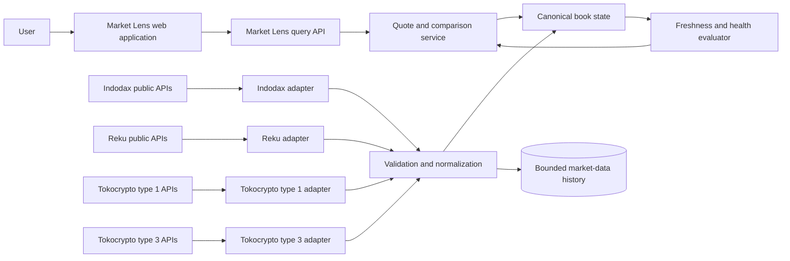

# Architecture: Komper Market Lens

## Document status

- Status: Accepted for WebSocket and period-aware Highcharts implementation
- Owner: CTO
- Last updated: 2026-07-18
- Related PRDs/ADRs: [Market Lens PRD](../product/market-lens-prd.md); [ADR-001: Market-data ingestion and normalization](./adr/ADR-001-market-data-ingestion-and-normalization.md); [ADR-002: Live market data and browser delivery](./adr/ADR-002-live-market-data-and-browser-delivery.md); [ADR-003: Markets read models and comparative chart](./adr/ADR-003-markets-read-models-and-comparative-chart.md)

## Context and goals

Komper Market Lens compares the estimated outcome of buying or selling an asset for a specified IDR notional across Indodax, Reku, and Tokocrypto. The estimate is derived from available order-book levels rather than the last traded price. It must expose the data time, venue, depth consumed, estimated average price, slippage, and fee assumptions so a user can judge the comparison. The Markets extension adds a browsable IDR market overview and pair detail that compare ticker statistics, order-book liquidity, recent transaction activity, and aligned OHLC history without implying that unlike venue feeds are perfectly equivalent.

Current state on 2026-07-18 is REST-snapshot only: each comparison calls `VenueAdapter.getBook()` and the browser polls `/api/comparisons` every 15 seconds. There is no exchange WebSocket worker, canonical live-book store, or browser live-delivery endpoint. The following accepted scope adds those pieces without weakening the existing decimal, increment, schema, fee, and health gates.

The repository contains API documentation collections for all three venues. Their interfaces are not symmetric:

- Indodax provides public REST and market WebSocket data, private account/trading APIs, a private order stream, and a documented deadman switch.
- Reku provides public REST and WebSocket market data plus authenticated balance, history, and trading endpoints, but the supplied collection does not document a private fill stream, idempotency key, sandbox, or deadman switch.
- Tokocrypto provides REST snapshots and sequenced depth deltas, trades, tickers, account/order history, private balance and execution events, OCO, self-trade prevention, and execution rules. Its routing varies by `symbolType` across multiple REST and WebSocket hosts. Its documented client order ID is not unique and therefore is not an idempotency mechanism.

The initial goal is an observational, public-data product covering canonical IDR markets. Effective-price ranking remains limited to markets simultaneously available and healthy at the compared venues. The Markets browse/read models may show the union of active, verified direct-IDR instruments so missing venue coverage is visible; a comparative winner or cross-venue claim still requires at least two healthy venues. Adding Tokocrypto makes three-venue comparison technically feasible, but it does not establish that every asset has comparable IDR liquidity at all three venues.

Explicit non-goals for the first release are:

- placing, cancelling, or automatically routing live orders;
- accepting or storing exchange API keys;
- comparing IDR and stablecoin markets through an implicit conversion rate;
- presenting an estimate as a firm or executable quote;
- claiming complete Indonesian exchange coverage or a reliability SLA before measurement;
- calculating portfolio performance, tax obligations, or deposit/withdrawal history.

## Quality attributes

- **Correctness:** Monetary values and quantities use decimal arithmetic. Venue payloads are schema-validated before entering canonical state. A book is eligible for comparison only after its synchronization rules pass.
- **Freshness:** Every normalized event records source time when supplied, receive time, processing time, connection epoch, and sequence/update identifiers when available. Product status distinguishes `LIVE`, `STALE`, `UNSYNCED`, `UNVERIFIED`, and `UNAVAILABLE`.
- **Reliability:** Missing events, sequence gaps, schema drift, clock skew, disconnections, HTTP 429/418, and venue 5XX responses fail closed for alerts and rankings. Workers reconnect and resynchronize without preserving an unverified book.
- **Performance:** The read path uses in-memory current-book state and a cache of precomputed estimates. Historical charts are capped at 1,000 closed candles per venue. Highcharts bundle impact is measured in the production build; route-level code splitting is an approved follow-up if the budget is exceeded, not a current guarantee. UI update frequency is bounded independently from ingest frequency. Concrete latency and throughput SLOs remain pending shadow-ingestion evidence.
- **Security and privacy:** The MVP consumes public endpoints only and stores no customer exchange credentials or private account data. Administrative actions and configuration changes are audited.
- **Maintainability:** Venue-specific parsing and routing remain inside capability-based adapters. Canonical contracts are versioned, and raw payload samples used for tests are separated from product domain objects.
- **Observability:** Operators can determine, per venue and instrument, whether a comparison was omitted because of staleness, sequence gaps, schema rejection, rate limiting, or insufficient depth.
- **Cost:** WebSocket streams are preferred for continuously changing data; REST calls are reserved for discovery, snapshots, recovery, and verification. Historical retention is bounded and configurable.
- **Accessibility:** Status and ranking changes are conveyed by text and semantics, not color alone. The Highcharts Accessibility module and an equivalent semantic OHLC table are required; reduced-motion preferences apply to all chart/live-update animation.
- **Comparable history:** Cross-venue absolute close prices use the same UTC buckets and IDR axis. Missing candles, including leading history before a later venue listing, remain gaps; they are never forward-filled, interpolated, or connected.

## System context



The exchange boundary is untrusted. Successful HTTP or WebSocket transport does not imply a valid or current domain event. The normalization boundary accepts only validated events and records rejected payloads as bounded diagnostic evidence with secrets removed.

## Components and ownership

| Component                      | Responsibility                                                                                                      | Interfaces/data                                                   | Owner                     |
| ------------------------------ | ------------------------------------------------------------------------------------------------------------------- | ----------------------------------------------------------------- | ------------------------- |
| Venue capability registry      | Records supported capabilities by venue and market segment, including routing and symbol transformations            | `VenueCapability`, `MarketSegment`, endpoint configuration        | Platform engineering      |
| Symbol discovery and registry  | Discovers venue instruments and maps them to canonical base/quote identities without discarding venue metadata      | `VenueInstrument`, `CanonicalInstrument`, symbol filters          | Market-data engineering   |
| Venue adapters                 | Own REST/WS protocols, response parsing, rate-limit feedback, reconnection, and segment-specific behavior           | Raw exchange payloads; normalized market events                   | Market-data engineering   |
| Validation and normalization   | Applies runtime schemas, decimal parsing, time normalization, and event-envelope construction                       | Versioned `MarketEvent` contracts                                 | Platform engineering      |
| Order-book state builders      | Build or replace local books, enforce sequence rules when available, and invalidate state on gaps                   | Snapshots, deltas, connection epochs, sync status                 | Market-data engineering   |
| Freshness and health evaluator | Determines whether each venue/instrument is eligible for display, ranking, and alerts                               | Lag, gap, schema, connection, and rate-limit signals              | Platform engineering      |
| Quote and comparison service   | Walks eligible order books for a side-appropriate size and returns weighted average price, slippage, depth, and assumptions | `ComparisonRequest`, `VenueEstimate`, `ComparisonResult`          | Application engineering   |
| Markets read-model service     | Builds bounded overview/detail projections for ticker, book, trade activity, and comparative OHLC without client fan-out | `MarketOverview`, `MarketDetail`, `OrderBookComparison`, `TradeActivity`, `CandleComparison` | Application engineering   |
| Candle builder                 | Validates native candles or aggregates normalized trades/ticks into aligned UTC OHLCV buckets and records completeness | `CanonicalTrade`, `CanonicalCandle`, interval/coverage metadata   | Market-data engineering   |
| Chart presentation             | Loads Highcharts on market detail, renders bounded close-price lines, period controls, partial/no-data status, and an equivalent data table | `CandleComparison`; `1d`, `1w`, `1y`, `all` period state          | Frontend engineering      |
| Current-state cache            | Serves synchronized books, catalog metadata, health, and recent estimates                                           | Keyed by venue, segment, and canonical instrument                 | Platform engineering      |
| Bounded history store          | Supports charts, investigations, replay tests, and reliability evidence                                             | Normalized events or sampled book snapshots with retention policy | Data/platform engineering |
| Query API                      | Provides read-only product contracts and preserves health/provenance in responses                                   | HTTP or typed RPC; no exchange credentials                        | Application engineering   |

Component ownership names are functional placeholders until teams are assigned.

## Key flows

### Instrument discovery

1. Each adapter fetches its venue catalog and validates the response.
2. The registry preserves the original venue symbol, base asset, quote asset, precision, filters, status, and Tokocrypto `symbolType`.
3. A canonical mapping job proposes base/quote identities. Ambiguous aliases remain `UNVERIFIED` and are excluded.
4. The eligible comparison set is the intersection of active, verified IDR instruments, not a hard-coded list.
5. Catalog changes are versioned and trigger a controlled subscription update.
6. The selectable trade-estimate catalog is the three-venue intersection. The Markets browse catalog is the verified direct-IDR union and includes an explicit per-venue `AVAILABLE`, `UNAVAILABLE`, or health state; the two concepts must not share an ambiguous `selectable` flag.

### Markets overview and pair routing

1. Client routes are `/markets` and canonical `/markets/:pair`, where `:pair` is lower-case `base-quote` such as `btc-idr`. Only direct `IDR` quote pairs are accepted in this release. Route parsing is case-insensitive, but a non-canonical path is replaced with its lower-case form; malformed paths show a route-level not-found state and a well-formed pair absent from the registry shows a market-not-found state.
2. Keep the centralized path parser for `/`, `/markets`, and `/markets/:pair`. Product has not approved period persistence in the URL, so period controls remain local state and use `1d` by default; background detail refresh preserves that state. TanStack Query remains the only network cache, keyed for candles by pair and period. If shareable period URLs are later approved, validated search state triggers TanStack Router adoption without duplicating the Query cache.
3. The overview is produced from one batched ticker/catalog operation per venue, never one upstream request per displayed pair. It lists the union of verified active IDR instruments and preserves an unavailable cell for a venue that does not list or cannot currently serve the pair.
4. In phase 1, the detail route consumes one aggregated BFF snapshot containing instrument identity plus independently settled ticker, order-book, trade, and candle components per venue. A component failure is represented inside the snapshot and does not erase healthy data. Capability-specific endpoints are the next step when measured latency, payload, or refresh-cadence differences justify independent loading.

### Ticker, trades, and OHLC ingestion

1. Venue adapters separately advertise `TICKER`, `ORDER_BOOK`, `TRADES`, and `CANDLES` capabilities. A venue or market segment is not assumed to support a capability because another segment does.
2. Tickers normalize last trade price, open/high/low, best bid/ask, base and quote volume, window start/duration, and source/receive times. Fields remain optional when the venue does not provide them. A last price is labeled as a historical trade, not an executable price.
3. Trades normalize an opaque venue trade ID when present, trade time, price, base quantity, derived quote notional, and aggressor side. Indodax and Reku side values and Tokocrypto's `isBuyerMaker` are mapped only after fixtures prove their taker-side semantics; otherwise `aggressorSide` is `UNKNOWN`. Aggregate and raw trade feeds preserve a `granularity` field and are not compared as event counts without a common aggregation definition.
4. Native venue candles are validated for field order and time units before normalization. Reku's documented array is `open, close, low, high`, unlike standard OHLC order; Tokocrypto uses standard `open, high, low, close`. Indodax chart ticks are inputs to the server-side candle builder rather than being mislabeled as native OHLC.
5. The candle builder uses half-open UTC intervals `[openTime, closeTime)`, exact decimal arithmetic, deterministic duplicate handling, and an `isClosed` flag. A reconnect or collection gap marks affected candles `PARTIAL`; it does not synthesize prices. Historical chart availability begins only where retained coverage is known, especially for Indodax, which has no documented historical OHLC REST response in the supplied collection.
6. Recent activity comparisons use the same requested wall-clock window and report base volume, quote volume, trade/aggregate count, buy/sell notional only where side semantics are verified, plus coverage start/end. No activity winner is shown when coverage or feed granularity differs materially.
7. Historical requests are period allowlisted rather than accepting arbitrary intervals or dates: `1d` uses 24 hourly buckets, `1w` uses at most 42 aligned four-hour buckets, `1y` uses at most 365 UTC daily buckets, and `all` uses Monday-00:00-UTC weekly buckets capped at 1,000 per venue. Only closed candles enter the projection.
8. The current live adapters fetch approximately 24 hourly candles and do not prove long-period symmetry. Longer periods require verified native pagination/backfill or the bounded history store. Until then the API returns actual partial/unsupported coverage; it never repeats the short sample under a longer label.

### Comparative price-movement chart

1. The API returns canonical absolute OHLC per venue. The primary single Highcharts Core chart overlays Indodax, Reku, and Tokocrypto `line` series using each closed candle's raw IDR `close`. This value is labeled “harga penutupan”, not live ticker `lastPrice`; the chart does not normalize, rank, or imply execution. Absolute O/H/L/C remain available in the tooltip and accessible table. Overlaying three candlestick series is rejected because occlusion makes comparison ambiguous.
2. Each accepted line point equals the corresponding canonical `close`. A venue without a valid candle at an aligned timestamp receives a null gap; the client never substitutes ticker/open/high/low, interpolates, forward-fills, or bridges that gap. A normalized-return view is deferred and is not part of the response contract.
3. The client requests only `period=1d|1w|1y|all`; the server selects and returns `1h`, `4h`, `1d`, or `1w` according to the fixed product policy. `All` starts at the earliest accepted retained bucket available from any supported venue, retains later venue listings as leading gaps, and returns the actual earliest date and retention limitations. Weekly buckets begin Monday at 00:00 UTC.
4. Each venue is capped at 1,000 closed buckets, allowing about 19 years of weekly `All` history and at most 3,000 chart points. A product-visible truncation and a new decision are required before approved retained history could exceed that bound.
5. Highcharts receives UTC timestamps, finite numeric display values, stable venue order, and nulls for gaps with `connectNulls: false`. Render any valid series, but use comparative language only when at least two venues overlap at a valid timestamp. A single line is observational and zero valid lines produces an application no-data state.
6. Use pinned `highcharts` plus the official `@highcharts/react` integration from npm, not a CDN. Load Highcharts Core and Accessibility in browser code; application-level no-data status is sufficient while no Highcharts no-data module is installed. Do not use Highcharts Stock or Boost initially: the 3,000-total-point ceiling remains below the default per-series Boost threshold, and standard SVG behavior better preserves interaction/accessibility. Preserve the semantic OHLC table, keyboard access, non-color series identification, reduced motion, and deliberate period-result announcements. Add route-level code splitting only if bundle evidence justifies it.
7. The current Vite application is client-rendered; server modules must not import Highcharts. If SSR is introduced, place chart imports behind a client-only dynamic boundary with a stable hydration placeholder. Validate Vite dependency pre-bundling/module initialization in development.

### Live order-book ingestion

1. A worker establishes the appropriate venue/segment WebSocket connection and creates a new connection epoch.
2. For feeds with snapshot-plus-delta semantics, it buffers deltas, obtains a REST snapshot, discards obsolete events, and applies only a valid contiguous sequence. Tokocrypto type 1 specifically uses `lastUpdateId` with `U`/`u` continuity.
3. For feeds documented as full book snapshots, the state builder atomically replaces the prior state. A feed is not treated as a delta unless the venue contract proves that behavior.
4. Every accepted book passes ordering, non-negative quantity, crossed-book, precision, and timestamp checks.
5. A gap, invalid payload, reconnect, or unexplained regression invalidates the book and starts resynchronization.
6. The freshness evaluator publishes eligibility independently from connection status.

### Effective-price comparison

1. The API validates side, canonical instrument, and a side-appropriate positive amount: an IDR quote budget for a buy or a canonical base-asset quantity for a sell. If the UI accepts an IDR value for a sell, it must convert that value once to a common base-quantity target using an explicit, returned reference price; it must not derive a different quantity independently from each venue.
2. The service selects only synchronized and fresh IDR books whose market price and market quantity increment rules are verified.
3. For a buy, it walks asks up to the IDR budget to obtain a raw base quantity, floors the total base quantity to the venue's verified market quantity step, then re-walks the book for that quantized quantity. The response reports actual consumed IDR and the unspent budget caused by quantization or depth.
4. For a sell, it floors the requested base quantity to the venue's verified market quantity step before walking bids. The response reports the unsold base remainder separately from an insufficient-depth remainder.
5. Existing order-book prices and active aggregate quantities are validated against their verified venue steps and are never silently rounded. The weighted average is a derived analytical value and is not required to lie on the price tick.
6. Minimum/maximum quantity and notional rules are evaluated after quantity quantization. A zero executable quantity or a rule violation produces no ranked estimate.
7. It calculates gross weighted average price, top-of-book reference, slippage, consumed levels, adjustment remainders, and book timestamps using decimal arithmetic.
8. Fees are calculated from the post-quantization consumed amounts and returned as a separate, versioned estimate with provenance. A venue is not ranked on an unverified fee assumption unless the response explicitly uses a gross-price ranking.
9. Results carry rule provenance, status, and exclusion reasons. Fewer than two eligible venues yields no comparative winner.

### Alert evaluation

1. Alert rules consume canonical comparison results, not raw venue messages.
2. A threshold must persist for a configured number of independent healthy observations or duration.
3. Any involved venue becoming stale, unsynchronized, schema-invalid, or unavailable suppresses the alert.
4. The event records inputs, timestamps, fee version, and health decision for later explanation.

### Failure and recovery

- REST 429/418 responses honor `Retry-After`; the affected adapter opens a circuit and does not shift load to uncontrolled retries.
- A Tokocrypto or other sequenced-book gap discards local state and repeats snapshot synchronization.
- WebSocket reconnects always create a new connection epoch. State from different epochs is never joined without a new synchronization point.
- Schema drift quarantines only the affected venue capability or segment and does not corrupt other venues.
- Clock-offset checks use venue server time where available. Receive-time freshness remains visible when source time is absent.
- Deployment rollback retains the last compatible canonical schema reader. Incompatible producers are stopped before rolling back consumers.
- Overview and detail projections use per-venue `Promise.allSettled` semantics or equivalent isolation. Healthy venue data is returned with explicit unavailable/stale peers; no stale value may be labeled current merely to keep a complete table.
- Server-side caches are keyed by canonical pair, venue, segment, capability, and query bounds. Concurrent identical refreshes are single-flighted. Ticker/book/trade snapshots have short configurable TTLs that never exceed their freshness threshold; expired last-known-good values may be displayed only with `STALE`, age, and last-success timestamps.
- The initial closed-candle endpoint uses `Cache-Control: private, max-age=60`; TanStack Query deduplicates in-flight browser work by canonical pair and period and retains the prior successful chart during a period change. BFF single-flight keyed by pair/period/interval/history version, immutable-bucket caching, `ETag` revalidation, and period-specific stale times are approved rollout follow-ups once retained history has a version; they are not current guarantees.
- The visible phase-1 client uses one configurable bounded polling cadence for the aggregate detail snapshot until capability endpoints are extracted; the overview has its own cadence. Polling pauses when the document is hidden or the browser is offline, and retries use capped exponential backoff with jitter. After extraction, ticker/book/trades and candles use separate cadences and manual retry targets only the failed projection.
- WebSocket ingest can run at exchange speed, but UI publication is coalesced to at most once per second. A transport reconnect, cache hit, or HTTP 200 never upgrades health without passing the capability's freshness and synchronization policy.

### Accepted WebSocket implementation contract

This release covers **public spot order books only** for the configured direct-IDR allowlist. Ticker, trade, candle, private, account, and execution streams are not part of this work.

| Capability | Exact protocol scope | Book and recovery policy |
| --- | --- | --- |
| Indodax spot | Connect server-side to `wss://ws3.indodax.com/ws/` with the documented static public-token handshake; method `1` subscribes to `market:order-book-<pair>`, method `2` unsubscribes, and method `7` is ping. Publications contain complete `ask`/`bid` arrays and an offset; subscription state includes `recoverable`, server `epoch`, and offset. | Treat every publication as a complete snapshot and atomically replace, never merge. Track server epoch, offset, connection epoch, and receive time. After disconnect attempt `recover:true` with the last accepted offset; accept recovered publications only for the same server epoch with contiguous increasing offsets. Epoch change, non-recoverable response, offset gap/regression, bad frame, or failed recovery invalidates the book. Rejoin cleanly, require a fresh valid full snapshot, and correlate with REST depth before eligibility. Because repository recovery examples use another channel, observed order-book recovery is a release gate; safe invalidation remains the fallback. |
| Reku spot | Connect server-side to Phoenix Channels at `wss://ws.reku.id/socket`, join `order:{coinId}`, process `data`, correlate join/error refs, send Phoenix heartbeat, and leave removed channels. Stay under documented limits: 10 connections/IP, 50 channels/connection, and 100 messages/second. | Each `bs.b`/`bs.s` payload is a complete snapshot and atomically replaces the prior book. Verify `i` equals the subscribed coin ID. Never merge and never invent a sequence or source time. A close, join/channel error, or heartbeat failure creates a new connection epoch and invalidates old state until the first valid new snapshot. Periodic REST correlation detects divergence; use receive-time health with `freshnessIndependentlyVerified:false`. |
| Tokocrypto spot type 1 | Use the documented type-1 diff-depth stream with lowercase symbol and `_` removed. Start with `<symbol>@depth`, not `@100ms`. Parse configured raw or combined wrappers. Frames carry source time `E`, symbol `s`, first/final IDs `U/u`, and absolute `b/a` quantities. REST depth supplies `lastUpdateId`. | Buffer before REST snapshot; discard `u <= lastUpdateId`; first accepted event must satisfy `U <= lastUpdateId + 1 <= u`; thereafter require `U == previous.u + 1`. Zero quantity removes a level. Publish nothing until synchronized. Gap, reorder, overflow, invalid frame, symbol mismatch, reconnect, or epoch change invalidates and restarts bootstrap. Handle ping/pong and renew before the documented 24-hour expiry. Enable `@100ms` only after backpressure/load evidence. |
| Tokocrypto spot type 3 | Use scheduled public REST snapshots from the documented type-3 depth host. No type-3 WebSocket in this release. | Atomically replace valid REST snapshots with transport `REST_POLL`; expose its lower cadence and no sequence guarantee. A type-3 WebSocket needs captured frames, proven independent snapshot/delta semantics, replay tests, and an ADR amendment. Type-1 semantics must never be reused. |

The Indodax static token is public protocol configuration, not a customer credential, but it remains server-side, configurable, and redacted. Browsers never connect to venue WebSockets or receive venue protocol tokens.

### Canonical live-book store and health

Implement a process-local `LiveBookStore` keyed by `(venue, marketSegment, venueSymbol)`, with exactly one writer per key. A capability-specific builder validates the complete next state privately, then publishes one immutable atomic record:

```text
LiveBookRecord {
  revision                 // local monotonic revision
  connectionEpoch
  transport                // WS_FULL_SNAPSHOT | WS_SEQUENCED_DELTA | REST_POLL
  sourceEventAt?
  receivedAt
  processedAt
  sourceSequenceStart?
  sourceSequenceEnd?
  sourceOffset?
  serverEpoch?
  synchronization          // SYNCHRONIZING | SYNCHRONIZED | UNSYNCED
  health                   // STARTING | LIVE | STALE | GAPPED | RECONNECTING | UNVERIFIED | UNAVAILABLE | STOPPED
  healthReason?
  canonicalBook?
}
```

Readers never see half-applied deltas. Reject old-epoch writes. Only `SYNCHRONIZED + LIVE` can rank or alert. Public status maps `GAPPED`, `RECONNECTING`, and `SYNCHRONIZING` to `UNSYNCED`; `STALE` remains `STALE`; stopped/unavailable maps to `UNAVAILABLE`. Connection supervisors use bounded exponential backoff with jitter, protocol-specific heartbeat, silence detection, and a new epoch per connection. An open socket is never sufficient for `LIVE`.

The store is intentionally non-durable. Restart begins empty and not-ready, creates new epochs, and bootstraps again; a persisted book must not be presented as current. The first deployment has one ingestion owner. Horizontal BFF scaling is blocked until leader election and canonical state distribution receive a separate decision.

### BFF-to-browser transport

Use same-origin **Server-Sent Events** at `GET /api/live/comparisons?asset=<asset>&side=<side>&amount=<decimal>`, validated by the existing request schema. Return `text/event-stream`, `Cache-Control: no-store`, and disable proxy buffering where supported.

- Send a full current `comparison` event immediately, then full replacement `ComparisonResponse` values when a relevant book or health revision changes.
- Additive fields may carry `streamRevision`, transport, synchronization, and health reason; existing REST response fields remain compatible.
- Coalesce only after canonical publication at a configurable UI cadence. Never drop/coalesce Tokocrypto deltas before the state builder.
- Send comment heartbeats. SSE IDs are process-local; `Last-Event-ID` is advisory. Reconnect always receives a newly computed full result rather than non-durable replay.
- Give each client one replaceable pending full result, not an unbounded queue. Disconnect a persistently slow consumer so it can reconnect to current state.
- Preserve selected asset, side, amount, focus, and scroll. Update the TanStack Query cache from SSE. The existing REST endpoint remains bootstrap and rollback; REST fallback cannot make an unhealthy live book eligible.

SSE is accepted because delivery is one-way and full-state based. Browser WebSocket adds an unnecessary bidirectional protocol, while 15-second polling adds avoidable latency and load.

## Contracts and data

The canonical identity does not assume that a symbol string is globally meaningful:

```text
CanonicalInstrument {
  baseAsset
  quoteAsset
}

VenueInstrument {
  venue
  marketSegment
  venueSymbol
  canonicalInstrument
  status
  marketPriceIncrementRule
  marketQuantityIncrementRule
  limitQuantityIncrementRule?
  minimumNotional
  metadataVersion
}
```

Tokocrypto type 1 and type 3 are separate `marketSegment` values even if they expose the same canonical base/quote pair. Routing and transformation, such as removing `_` and lowercasing a type 1 WebSocket symbol, are adapter concerns.

All normalized market messages use a versioned envelope:

```text
MarketEvent<T> {
  schemaVersion
  eventId
  venue
  marketSegment
  venueSymbol
  canonicalInstrument
  sourceEventAt?       // optional because venues differ
  receivedAt           // required UTC instant
  processedAt          // required UTC instant
  sequenceStart?
  sequenceEnd?
  snapshotId?
  connectionEpoch
  payload: T
}
```

Prices and quantities enter the domain as validated decimal strings and are converted to an arbitrary-precision decimal type. JSON numbers from a venue are not accepted into financial calculations through binary floating point.

Trading increments use a normalized rule rather than a bare number:

```text
IncrementRule {
  state                 // VERIFIED | DISABLED | UNVERIFIED
  normalizedStep?       // positive canonical decimal string when VERIFIED
  sourceField
  sourceValue
  sourceSemantics       // STEP_SIZE | DECIMAL_PLACES | EXPLICITLY_DISABLED
  metadataVersion
  verifiedAt?
}
```

The adapter must know the semantics of each source field from a venue-specific contract:

- a step-valued field such as `0.00000001` is preserved as the exact normalized step;
- a decimal-count field such as `8` becomes `0.00000001` by the exact operation `10^-8`;
- an integer-looking value is never guessed to be a decimal count merely because that interpretation seems plausible;
- zero means `DISABLED` only where the venue contract explicitly defines zero as disabling the rule;
- a missing, contradictory, non-positive, unparsable, or semantically ambiguous value is `UNVERIFIED`.

The selected market quantity rule is allowed to fall back to another venue field, such as a general lot-size rule, only when that fallback is explicitly defined and tested for that venue and market segment. Reku and Indodax mappings therefore have independent contract fixtures for step-value versus decimal-count fields. Metadata heuristics are prohibited.

Quantization uses exact decimal lattice operations. For a positive quantity `q` and verified step `s`, both buy and sell use `floor(q / s) * s`. This protects a buy budget from overspend and prevents a sell from exceeding the requested quantity or available holdings. The final executable quantity must have an exact zero remainder modulo `s`. Fees, taxes, weighted average price, and net proceeds are derived values and are not quantized to the order-size step.

Market Lens does not construct a limit order, so it does not round book prices. If a future order-planning capability emits a protective limit price, it requires a separate execution contract; the safe default is to floor a buy limit price and ceil a sell limit price to the verified price step, with the adjustment disclosed before confirmation.

If either required increment rule is `UNVERIFIED`, or if any active book level violates a verified rule, that venue/instrument is marked `UNVERIFIED_RULES`, excluded from winner selection, and suppressed from alerts. The service must not substitute a default precision or round malformed market data into validity.

The query API returns, at minimum:

```text
VenueEstimate {
  venue
  marketSegment
  status
  statusReason?
  requestedQuoteBudget?
  requestedBaseQuantity?
  executableBaseQuantity?
  grossAveragePrice?
  estimatedFee?
  netOutcome?
  feeScheduleVersion?
  topOfBookPrice?
  slippageBps?
  filledNotional?
  unspentQuoteAmount?
  unsoldBaseAmount?
  quantizationAdjustment?
  levelsConsumed?
  priceIncrementRule
  quantityIncrementRule
  ruleMetadataVersion
  quantityRoundingMode      // FLOOR for MVP
  sellReferencePrice?       // present when UI IDR input was converted to base
  sellReferenceProvenance?
  sourceEventAt?
  receivedAt?
}
```

The Markets API is a read-model boundary, not a pass-through proxy. All pair parameters use canonical `BASE-IDR` identity internally even though the client route is lower-case. Proposed version-1 resources are:

| Endpoint | Purpose and bounds | Cache/failure contract |
| --- | --- | --- |
| `GET /api/markets?quote=IDR&limit=100&cursor=...` | Paginated overview, stable canonical sort, per-venue ticker and health; `limit` max 100 | BFF ticker snapshot/single-flight cache; HTTP `no-store`; partial venue states in a successful response |
| `GET /api/markets/:pair` | Phase-1 bounded snapshot: pair identity plus per-venue ticker, order book, recent trades, OHLC, component availability, and health | HTTP `no-store`; adapters settle independently; valid but unknown pair is `404 MARKET_NOT_FOUND` |
| `GET /api/markets/:pair/order-books?depth=20` | Follow-up projection: canonical bids/asks plus spread, midpoint and comparable cumulative liquidity; depth max 100 | Independent response and health, HTTP `no-store` |
| `GET /api/markets/:pair/trades?window=15m&limit=50` | Follow-up projection: bounded recent trades and same-window activity metrics; limit max 100 and allowlisted windows | Independent response and coverage metadata, HTTP `no-store` |
| `GET /api/markets/:pair/candles?period=1d|1w|1y|all` | Extracted projection: per-venue closed absolute OHLC, raw close lines, selected interval, actual bounds, and retention coverage; max 1,000 buckets per venue | Initial `private, max-age=60`; partial/unsupported venue coverage remains explicit. `ETag` and BFF single-flight are rollout follow-ups after history versioning |

An endpoint returns `200` when its projection was built even if one or all venue entries are unavailable; each venue carries its own status and reason. `400 INVALID_REQUEST` is used for malformed, repeated, array-shaped, or unsupported query values, `404 MARKET_NOT_FOUND` for a valid canonical pair absent from the registry, `422 UNSUPPORTED_COMBINATION` for a known pair whose requested period cannot be projected, `429` for product API rate limiting, and `503 SERVICE_UNAVAILABLE` only when the BFF cannot build the projection itself. Error bodies retain the existing `{ error: { code, message, details? } }` envelope.

The aggregate is a snapshot/read-model convenience, not a new canonical domain object and not an invitation to call venues from the browser. Order book and trade limits remain server constants. The historical period feature executes the candle extraction trigger: the aggregate may retain its fixed short candle sample for compatibility during migration, but the Highcharts view reads only the period-aware candle projection. A slow or unavailable history request therefore does not erase ticker, order-book, or activity data.

The candle response contains `schemaVersion`, `pair`, `period`, `interval`, `generatedAt`, requested/available bounds, and stable Indodax/Reku/Tokocrypto entries. Venue entries contain status/reason, actual coverage start/end, missing-bucket count, retention limitation, and canonical absolute closed candles. `all` means approved retained coverage beginning at the earliest accepted bucket available from any supported venue and must expose its actual start date; it is not an exchange-inception claim.

Core canonical additions are:

```text
CanonicalTicker {
  venue, marketSegment, venueSymbol, canonicalInstrument
  lastPrice?, openPrice?, highPrice?, lowPrice?, bestBid?, bestAsk?
  baseVolume?, quoteVolume?, windowStartAt?, windowDuration?
  sourceEventAt?, receivedAt, status, statusReason?
}

CanonicalTrade {
  venue, marketSegment, venueSymbol, canonicalInstrument
  tradeId?, eventAt, price, baseQuantity, quoteNotional
  aggressorSide                 // BUY | SELL | UNKNOWN
  granularity                   // RAW | AGGREGATED
  sourceEventAt?, receivedAt
}

CanonicalCandle {
  venue, marketSegment, canonicalInstrument, interval
  openTime, closeTime, open, high, low, close
  baseVolume?, quoteVolume?, tradeCount?
  isClosed, coverageStatus      // COMPLETE | PARTIAL
  provenance                   // NATIVE | AGGREGATED_TRADES | AGGREGATED_TICKS
  sourceEventAt?, receivedAt
}

CandleComparison {
  schemaVersion, instrument, period, interval, generatedAt
  requestedFromAt?, requestedToAt, availableFromAt?, availableToAt?
  series[] {
    venue, status, exclusionReason?, coverageStartAt?, coverageEndAt?, missingBucketCount?
    points[] { openTime, closeTime, open, high, low, close, isClosed, coverageStatus }
  }
}
```

Order-book summaries use fixed economic bands around a validated midpoint (for example cumulative IDR liquidity within 10/25/50 basis points), not only a fixed count of rows. Raw levels remain venue-specific observations. All candle and monetary decimal values are canonical strings; conversion to finite chart display numbers occurs only after response validation.

Raw venue payload retention is off by default except for bounded, access-controlled diagnostic samples. Normalized candles are retained for each released chart period plus a late-arrival/recovery margin; rollout cannot advertise a period for which known coverage does not exist. `All` remains weekly and is capped at 1,000 buckets per venue; exceeding that approved retained-history bound requires a product-visible truncation decision rather than silent downsampling. Schema versions are additive where possible; breaking changes use a new version with dual-read migration.

## Security and privacy

- Market Lens MVP has no route, environment variable, database field, or client form for private exchange keys.
- Exchange responses are untrusted input. Enforce response-size limits, runtime schemas, numeric bounds, URL allowlists, TLS verification, and timeouts.
- Venue base URLs and symbol routing come from reviewed server configuration, not end-user input, preventing server-side request forgery.
- Public API abuse is controlled with user-level rate limits, request bounds, caching, and protection against arbitrary pair fan-out.
- Market paths are parsed into canonical symbols and looked up in the registry. User input never selects an upstream hostname, raw venue symbol, Tokocrypto segment, arbitrary dates, or an interval. Pair length, depth, trade limit, allowlisted period, cursor, and response size are bounded before any adapter call.
- The web application uses a restrictive Content Security Policy appropriate to its chart implementation. Chart labels and exchange-sourced names are rendered as text, external venue links use reviewed templates with `noopener noreferrer`, and no raw upstream HTML or image URL is trusted by default.
- Diagnostic payloads are sampled and bounded. Headers, query parameters, tokens, cookies, and future credentials are redacted before logging.
- Alert configuration and delivery destinations are user data and follow the product privacy and deletion policy once defined.
- If Portfolio or Execution is added later, it must use a separate credential service and trust boundary. The public market-data workers must never receive private API secrets.

## Operations and observability

Deploy adapters independently by venue and market segment so a schema or routing failure has a limited blast radius. Configuration includes endpoint allowlists, subscriptions, reconnect policy, conservative REST budgets, freshness thresholds, and schema versions.

Required metrics include:

- connection state, reconnect count, connection age, and subscription count;
- messages and bytes received by venue, segment, channel, and schema version;
- source-to-receive and receive-to-process lag distributions;
- sequence gaps, resynchronizations, crossed books, rejected payloads, and unknown symbols;
- REST latency, response codes, Tokocrypto used-weight headers, `Retry-After`, and circuit state;
- synchronized/fresh instrument count and comparison-eligible venue count;
- estimate latency, insufficient-depth rate, suppressed rankings, and suppressed alerts.
- Markets endpoint latency and cache hit/single-flight rate by projection; overview pair count and payload size; per-capability stale/unavailable ratio; candle gaps, partial buckets, history coverage/retention, overlapping venues, and points returned; client panel error and retry rate.

Alerts should cover loss of all data for a venue, elevated stale-book ratio, repeated sequence gaps, schema-rejection spikes, sustained rate limiting, catalog mapping changes, and comparison eligibility falling below two venues for critical instruments.

Runbooks are required for venue outage, WebSocket reconnect storm, sequence-gap loop, clock skew, schema change, rate-limit ban, catalog delisting, and rollback. Reliability claims require at least 72 hours of shadow ingestion for the technical gate and 30 days of observed evidence before publishing an availability claim.

## Delivery and migration

WebSocket delivery order is fixed:

1. Add deterministic clocks/schedulers, connection epochs, health transitions, `LiveBookStore`, and replay fixtures while REST remains user-visible.
2. Add Indodax and Reku full-snapshot workers in shadow mode; prove isolation, recovery, heartbeat, REST correlation, and resource bounds.
3. Add Tokocrypto type-1 sequencing in shadow mode; leave type 3 on `REST_POLL`.
4. Add SSE and client cache replacement behind a feature flag, retaining `/api/comparisons` for bootstrap and rollback.
5. Complete the 72-hour shadow gate, then cut over one allowlisted IDR pair at a time. Rollback disables that pair/capability, invalidates its live record, and returns the UI to labeled REST behavior.

Graceful shutdown marks readiness false, stops new SSE subscriptions, invalidates live state, unsubscribes/leaves where possible, closes venue sockets, and terminates. Restart never bridges connection epochs.

1. **Contract harness:** Capture representative fixtures from the supplied documentation, define runtime schemas, implement decimal and canonical-symbol tests, and record unresolved contract contradictions.
2. **Shadow adapters:** Implement discovery and public REST snapshots for all venues. Run without user-visible rankings and measure schema validity, pair overlap, timestamps, rate behavior, and depth completeness.
3. **Live books:** Add WebSocket workers and per-capability state builders. For Tokocrypto type 1, implement and fault-inject the documented snapshot/delta sequence algorithm. Treat type 3 separately until its production semantics are verified.
4. **Read-only beta:** Enable comparison behind a feature flag for a small verified IDR pair allowlist. Display status, time, gross estimate, insufficient depth, and fee provenance.
5. **Markets overview:** Add batched ticker capabilities and the union browse projection. Enable `/markets` only after all-pair requests are shown not to create upstream N+1 load.
6. **Pair detail phase 1:** Add the bounded aggregated snapshot with independently settled ticker, order-book, recent-trade, and candle components. Missing components remain explicit instead of blocking the route.
7. **Historical candle extraction:** Add bounded `/candles?period=...` with a private 60-second browser cache, fixed period-to-interval mapping, actual coverage metadata, and bounded collection/backfill. Enable each period only after coverage and gap evidence pass; add ETag/server single-flight only in a measured, history-versioned follow-up.
8. **Period state and Highcharts:** Add local period state plus pair/period TanStack Query keys without changing the route parser, then replace the SVG chart with the Highcharts Core line comparison after visual, accessibility, performance, and licensing gates pass. URL persistence/TanStack Router, a feature flag, and ETag/single-flight caching remain explicit follow-ups rather than current guarantees.
9. **Comparative history:** Backfill where a verified native endpoint permits it and begin bounded collection where it does not. Each plotted point remains the venue's absolute canonical close; comparative language requires two overlapping series.
10. **Alerts and longer history:** Enable only after freshness suppression, persistence rules, replay, and operational alerting pass.
11. **Coverage expansion:** Move pairs from `UNVERIFIED` through shadow validation into the browse union and, separately, the effective-price intersection. Rollback removes a pair, segment, venue capability, or Markets panel through configuration without changing canonical contracts.

No private API or execution code is included in these phases. A separate architecture decision is required before expanding the trust boundary.

## Risks and unresolved decisions

| Item                                                                            | Impact                                                         | Owner                               | Resolution path                                                                                           |
| ------------------------------------------------------------------------------- | -------------------------------------------------------------- | ----------------------------------- | --------------------------------------------------------------------------------------------------------- |
| Rights to store and commercialize derived venue data are not established        | Could block monetization or historical retention               | Product/legal                       | Review each venue's current terms and obtain written permission where required                            |
| Exact cross-venue IDR pair overlap is not live-verified                         | Coverage may be narrower than expected                         | Product and market-data engineering | Run symbol discovery and publish a measured coverage matrix                                               |
| Tokocrypto `symbolType` documentation conflicts with type 3 routes and examples | Wrong host or symbol transform can silently omit data          | Market-data engineering             | Probe catalogs/routes in shadow mode and version segment routing                                          |
| Tokocrypto depth limits conflict between REST and WebSocket instructions        | Snapshot synchronization may fail at requested depth           | Market-data engineering             | Contract-test supported limits and configure the largest verified value                                   |
| Tokocrypto numeric rate-limit ceilings are absent from the supplied collection  | IP bans or insufficient polling capacity                       | Platform engineering                | Use WebSocket-first ingestion, conservative budgets, response-header feedback, and production observation |
| Fee schedules and user-tier variation are not yet normalized                    | Net ranking may be misleading                                  | Product and finance/domain owner    | Establish versioned fee sources and show gross ranking until verified                                     |
| Freshness thresholds and service SLOs are not measured                          | Premature `LIVE` or reliability claims                         | CTO and QA                          | Derive thresholds from 72-hour and 30-day observations, then approve SLOs                                 |
| Reku and some other book streams lack documented sequence semantics             | Undetected message loss could leave a plausible but wrong book | Market-data engineering             | Prefer atomic snapshots where documented and periodically refresh via REST                                |
| Stablecoin and IDR markets are not directly comparable                          | False arbitrage signals                                        | Product and CTO                     | Keep MVP IDR-only; require a separate explicit FX-route design later                                      |
| Historical storage granularity and retention are undecided                      | Cost and product capability uncertainty                        | Product and CTO                     | Measure volume, define use cases, and approve retention before persistence expansion                      |
| Indodax supplied docs expose chart ticks but no historical OHLC REST endpoint   | Requested periods may be unavailable until enough data is collected | Market-data engineering and Product | Aggregate verified ticks/trades, expose coverage start/gaps, and gate periods rather than fabricate backfill |
| Venue 24-hour windows and trade feed granularity may differ                     | Ticker and activity values may look directly comparable when they are not | Market-data engineering and Product | Preserve window/granularity provenance; compare only same-window derived metrics and label exceptions      |
| Three overlay series can begin at different available times                     | Connecting leading/middle gaps would imply prices that were never observed | Application engineering             | Align canonical UTC timestamps, use null points with `connectNulls: false`, and show per-venue coverage    |
| Current adapters fetch only a short hourly window                               | `1W`, `1Y`, or `All` could falsely appear complete              | Market-data engineering and Product | Extract period-aware history, use verified pagination/storage, return coverage, and gate unsupported periods |
| `All` can be interpreted as venue-lifetime history                              | Users may infer nonexistent historical completeness             | Product and Application engineering | Define it as approved retained weekly coverage, show the exact earliest date, later-listing gaps, and retention limits |
| Highcharts has production licensing and bundle obligations                      | Legal exposure or an avoidable main-bundle regression            | Product/legal and Frontend engineering | Record the correct deployment license, install pinned npm packages, lazy-load where measured value justifies it, and roll back with the prior known-good build; a feature flag is a follow-up option |
| Highcharts module initialization or future SSR touches browser globals          | Development-only failures or hydration mismatch                  | Frontend engineering                 | Keep server imports forbidden, validate Vite pre-bundling, and use a client-only boundary if SSR is added  |
| All-market overview could cause upstream request fan-out                        | Rate limiting, latency, or venue bans                           | Platform engineering                | Require batched venue capabilities, cache/single-flight, pagination, payload budgets, and load tests       |
| Phase-1 detail aggregates capabilities with unlike size and cadence             | A slow component delays the snapshot and static OHLC may be retransferred with fast data | Application engineering | Keep bounded independent settlement and component timings; extract endpoints when latency/payload/retry thresholds are exceeded |

## Verification

- Indodax protocol tests cover handshake, subscribe/ping acknowledgments, atomic full replacement, epoch, duplicate/regressing offsets, contiguous recovery, and clean-snapshot fallback.
- Reku protocol tests cover Phoenix join/leave/error/heartbeat, coin-ID validation, full replacement, reconnect invalidation, receive-time disclosure, and REST mismatch quarantine.
- Tokocrypto type-1 replay covers snapshot race, stale/overlap/duplicate/gap/reorder `U/u`, zero deletion, overflow, reconnect, ping/pong, and planned 24-hour renewal. Configuration tests prove type 3 cannot register a WebSocket or type-1 builder.
- Live-store tests cover atomic revision publication, one writer, old-epoch rejection, health mapping, shutdown/restart invalidation, and zero unhealthy books ranked.
- SSE integration and Playwright tests cover initial/replacement results, coalescing, slow consumer, stale/gap removal, reconnect refetch, partial availability, preserved input/focus, reduced motion, and absence of exchange URLs/tokens in browser traffic.
- Candle contract/property tests cover all four period mappings, UTC four-hour/day aggregation, Monday-00:00-UTC weekly aggregation, closed-bucket exclusion, exact close values, actual `all` coverage, gaps, partial venues, 1,000-point caps, and aborted period-request races. ETag/304 and BFF single-flight tests gate the later cache rollout, not this initial implementation.
- Highcharts browser tests cover all three raw close lines, two-series comparison, one-series observational and zero-series no-data states, accessible names/table equivalence, keyboard period and series controls, non-color identification, local-state persistence across background refresh, reduced motion, and a maximum 3,000-point render budget. Back/forward period restoration is deferred with URL persistence.
- Dependency release evidence includes exact Highcharts versions, Vite development and production builds, chunk-size comparison, CSP behavior, vulnerability review, and a recorded license appropriate to internal or public deployment.

- Runtime contract tests for every documented response variant and malformed, missing, additional, or type-shifted fields.
- Property tests for decimal parsing, precision, order-book sorting, weighted average price, slippage, insufficient liquidity, and fee calculations.
- Adapter contract tests distinguish step-valued metadata from decimal-count metadata for every venue and segment; integer-looking values cannot be inferred heuristically.
- Quantization tests prove that buy and sell executable quantities are floored to the verified market step, have an exact zero remainder, never exceed the buy budget or sell request, and expose all remainders.
- Rule tests cover missing, zero, negative, contradictory, and unverified increments, explicit disabled rules, post-quantization minimum notional, and non-aligned order-book levels.
- Canonical-symbol tests covering underscore removal, case transformation, quote assets, aliases, and Tokocrypto market segments.
- Deterministic replay tests for duplicate, reordered, missing, and overlapping snapshots/deltas.
- Tokocrypto sequence tests for stale-event discard, first-event overlap, contiguous `U/u`, gaps, reconnects, and snapshot retry.
- Crossed-book, negative quantity, timestamp regression, clock-skew, stale-state, and schema-quarantine tests.
- Adapter integration tests for HTTP 429/418/5XX, `Retry-After`, partial responses, timeouts, WebSocket ping/pong, 24-hour reconnect, and catalog changes.
- End-to-end browser coverage for healthy comparison, single-venue failure, fewer-than-two venues, stale data, insufficient depth, fee uncertainty, loading, empty, and error states.
- Route tests for `/markets`, canonical `/markets/btc-idr`, upper-case normalization, malformed pairs, unknown valid pairs, deep-link reload, browser back/forward, focus restoration, and route-level not found. API tests own strict `period` query validation while period remains local browser state.
- Contract tests for overview pagination and deterministic sorting; per-venue partial failure; ticker window provenance; bounded order-book depth; trade limits, granularity, deduplication, and taker-side mapping; and stable API error envelopes.
- Candle fixtures prove each venue's field order and seconds/milliseconds conversion. Aggregation tests cover UTC interval boundaries, duplicate and out-of-order trades/ticks, reconnect gaps, open versus closed buckets, volume, and `PARTIAL` coverage.
- Comparative-chart property tests prove every non-null display point equals its canonical candle `close`, exact period/interval boundaries, Monday weekly alignment, no interpolation or substitution, deterministic gaps, and the 1,000-point-per-venue ceiling. Visual/accessibility tests expose the same absolute OHLC without relying on color or hover.
- Performance tests prove overview ingestion uses at most one batched ticker operation per venue per refresh, identical concurrent requests are single-flighted, hidden/offline clients stop polling, payload budgets hold at the maximum page/depth/period, and one failing venue does not delay healthy venue responses beyond the configured timeout.
- Accessibility checks for keyboard use, screen-reader status, non-color indicators, and reduced motion.
- A 72-hour shadow-ingestion report containing environment, scope, pair coverage, gaps, schema failures, rate-limit observations, freshness distributions, and residual risks.
- A threat-model review confirming that the MVP contains no exchange credential path and that endpoint configuration cannot be user-controlled.
- Relevant format, type-check, lint, test, and build gates once implementation is scaffolded.
