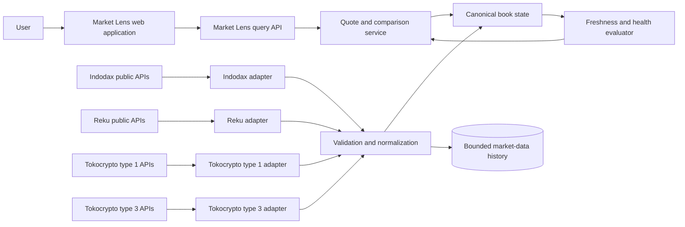

# Architecture: Komper Market Lens

## Document status

- Status: Draft
- Owner: CTO
- Last updated: 2026-07-17
- Related PRDs/ADRs: [Market Lens PRD](../product/market-lens-prd.md); [ADR-001: Market-data ingestion and normalization](./adr/ADR-001-market-data-ingestion-and-normalization.md)

## Context and goals

Komper Market Lens compares the estimated outcome of buying or selling an asset for a specified IDR notional across Indodax, Reku, and Tokocrypto. The estimate is derived from available order-book levels rather than the last traded price. It must expose the data time, venue, depth consumed, estimated average price, slippage, and fee assumptions so a user can judge the comparison.

The repository contains API documentation collections for all three venues. Their interfaces are not symmetric:

- Indodax provides public REST and market WebSocket data, private account/trading APIs, a private order stream, and a documented deadman switch.
- Reku provides public REST and WebSocket market data plus authenticated balance, history, and trading endpoints, but the supplied collection does not document a private fill stream, idempotency key, sandbox, or deadman switch.
- Tokocrypto provides REST snapshots and sequenced depth deltas, trades, tickers, account/order history, private balance and execution events, OCO, self-trade prevention, and execution rules. Its routing varies by `symbolType` across multiple REST and WebSocket hosts. Its documented client order ID is not unique and therefore is not an idempotency mechanism.

The initial goal is an observational, public-data product covering canonical IDR markets that are simultaneously available and healthy at the compared venues. Adding Tokocrypto makes three-venue comparison technically feasible, but it does not establish that every asset has comparable IDR liquidity at all three venues.

Explicit non-goals for the first release are:

- placing, cancelling, or automatically routing live orders;
- accepting or storing exchange API keys;
- comparing IDR and stablecoin markets through an implicit conversion rate;
- presenting an estimate as a firm or executable quote;
- claiming complete Indonesian exchange coverage or a reliability SLA before measurement;
- calculating portfolio performance, tax obligations, or deposit/withdrawal history.

## Quality attributes

- **Correctness:** Monetary values and quantities use decimal arithmetic. Venue payloads are schema-validated before entering canonical state. A book is eligible for comparison only after its synchronization rules pass.
- **Freshness:** Every normalized event records source time when supplied, receive time, processing time, connection epoch, and sequence/update identifiers when available. Product status distinguishes `LIVE`, `STALE`, `UNSYNCED`, `UNVERIFIED`, and `UNAVAILABLE`.
- **Reliability:** Missing events, sequence gaps, schema drift, clock skew, disconnections, HTTP 429/418, and venue 5XX responses fail closed for alerts and rankings. Workers reconnect and resynchronize without preserving an unverified book.
- **Performance:** The read path uses in-memory current-book state and a cache of precomputed estimates. UI update frequency is bounded independently from ingest frequency. Concrete latency and throughput SLOs remain pending shadow-ingestion evidence.
- **Security and privacy:** The MVP consumes public endpoints only and stores no customer exchange credentials or private account data. Administrative actions and configuration changes are audited.
- **Maintainability:** Venue-specific parsing and routing remain inside capability-based adapters. Canonical contracts are versioned, and raw payload samples used for tests are separated from product domain objects.
- **Observability:** Operators can determine, per venue and instrument, whether a comparison was omitted because of staleness, sequence gaps, schema rejection, rate limiting, or insufficient depth.
- **Cost:** WebSocket streams are preferred for continuously changing data; REST calls are reserved for discovery, snapshots, recovery, and verification. Historical retention is bounded and configurable.
- **Accessibility:** Status and ranking changes are conveyed by text and semantics, not color alone. Reduced-motion preferences apply to live-update animation in the consuming application.

## System context



The exchange boundary is untrusted. Successful HTTP or WebSocket transport does not imply a valid or current domain event. The normalization boundary accepts only validated events and records rejected payloads as bounded diagnostic evidence with secrets removed.

## Components and ownership

| Component                      | Responsibility                                                                                                      | Interfaces/data                                                   | Owner                     |
| ------------------------------ | ------------------------------------------------------------------------------------------------------------------- | ----------------------------------------------------------------- | ------------------------- |
| Venue capability registry      | Records supported capabilities by venue and market segment, including routing and symbol transformations            | `VenueCapability`, `MarketSegment`, endpoint configuration        | Platform engineering      |
| Symbol discovery and registry  | Discovers venue instruments and maps them to canonical base/quote identities without discarding venue metadata      | `VenueInstrument`, `CanonicalInstrument`, symbol filters          | Market-data engineering   |
| Venue adapters                 | Own REST/WS protocols, response parsing, rate-limit feedback, reconnection, and segment-specific behavior           | Raw exchange payloads; normalized market events                   | Market-data engineering   |
| Validation and normalization   | Applies runtime schemas, decimal parsing, time normalization, and event-envelope construction                       | Versioned `MarketEvent` contracts                                 | Platform engineering      |
| Order-book state builders      | Build or replace local books, enforce sequence rules when available, and invalidate state on gaps                   | Snapshots, deltas, connection epochs, sync status                 | Market-data engineering   |
| Freshness and health evaluator | Determines whether each venue/instrument is eligible for display, ranking, and alerts                               | Lag, gap, schema, connection, and rate-limit signals              | Platform engineering      |
| Quote and comparison service   | Walks eligible order books for a side-appropriate size and returns weighted average price, slippage, depth, and assumptions | `ComparisonRequest`, `VenueEstimate`, `ComparisonResult`          | Application engineering   |
| Current-state cache            | Serves synchronized books, catalog metadata, health, and recent estimates                                           | Keyed by venue, segment, and canonical instrument                 | Platform engineering      |
| Bounded history store          | Supports charts, investigations, replay tests, and reliability evidence                                             | Normalized events or sampled book snapshots with retention policy | Data/platform engineering |
| Query API                      | Provides read-only product contracts and preserves health/provenance in responses                                   | HTTP or typed RPC; no exchange credentials                        | Application engineering   |

Component ownership names are functional placeholders until teams are assigned.

## Key flows

### Instrument discovery

1. Each adapter fetches its venue catalog and validates the response.
2. The registry preserves the original venue symbol, base asset, quote asset, precision, filters, status, and Tokocrypto `symbolType`.
3. A canonical mapping job proposes base/quote identities. Ambiguous aliases remain `UNVERIFIED` and are excluded.
4. The eligible comparison set is the intersection of active, verified IDR instruments, not a hard-coded list.
5. Catalog changes are versioned and trigger a controlled subscription update.

### Live order-book ingestion

1. A worker establishes the appropriate venue/segment WebSocket connection and creates a new connection epoch.
2. For feeds with snapshot-plus-delta semantics, it buffers deltas, obtains a REST snapshot, discards obsolete events, and applies only a valid contiguous sequence. Tokocrypto type 1 specifically uses `lastUpdateId` with `U`/`u` continuity.
3. For feeds documented as full book snapshots, the state builder atomically replaces the prior state. A feed is not treated as a delta unless the venue contract proves that behavior.
4. Every accepted book passes ordering, non-negative quantity, crossed-book, precision, and timestamp checks.
5. A gap, invalid payload, reconnect, or unexplained regression invalidates the book and starts resynchronization.
6. The freshness evaluator publishes eligibility independently from connection status.

### Effective-price comparison

1. The API validates side, canonical instrument, and a side-appropriate positive amount: an IDR quote budget for a buy or a canonical base-asset quantity for a sell. If the UI accepts an IDR value for a sell, it must convert that value once to a common base-quantity target using an explicit, returned reference price; it must not derive a different quantity independently from each venue.
2. The service selects only synchronized and fresh IDR books whose market price and market quantity increment rules are verified.
3. For a buy, it walks asks up to the IDR budget to obtain a raw base quantity, floors the total base quantity to the venue's verified market quantity step, then re-walks the book for that quantized quantity. The response reports actual consumed IDR and the unspent budget caused by quantization or depth.
4. For a sell, it floors the requested base quantity to the venue's verified market quantity step before walking bids. The response reports the unsold base remainder separately from an insufficient-depth remainder.
5. Existing order-book prices and active aggregate quantities are validated against their verified venue steps and are never silently rounded. The weighted average is a derived analytical value and is not required to lie on the price tick.
6. Minimum/maximum quantity and notional rules are evaluated after quantity quantization. A zero executable quantity or a rule violation produces no ranked estimate.
7. It calculates gross weighted average price, top-of-book reference, slippage, consumed levels, adjustment remainders, and book timestamps using decimal arithmetic.
8. Fees are calculated from the post-quantization consumed amounts and returned as a separate, versioned estimate with provenance. A venue is not ranked on an unverified fee assumption unless the response explicitly uses a gross-price ranking.
9. Results carry rule provenance, status, and exclusion reasons. Fewer than two eligible venues yields no comparative winner.

### Alert evaluation

1. Alert rules consume canonical comparison results, not raw venue messages.
2. A threshold must persist for a configured number of independent healthy observations or duration.
3. Any involved venue becoming stale, unsynchronized, schema-invalid, or unavailable suppresses the alert.
4. The event records inputs, timestamps, fee version, and health decision for later explanation.

### Failure and recovery

- REST 429/418 responses honor `Retry-After`; the affected adapter opens a circuit and does not shift load to uncontrolled retries.
- A Tokocrypto or other sequenced-book gap discards local state and repeats snapshot synchronization.
- WebSocket reconnects always create a new connection epoch. State from different epochs is never joined without a new synchronization point.
- Schema drift quarantines only the affected venue capability or segment and does not corrupt other venues.
- Clock-offset checks use venue server time where available. Receive-time freshness remains visible when source time is absent.
- Deployment rollback retains the last compatible canonical schema reader. Incompatible producers are stopped before rolling back consumers.

## Contracts and data

The canonical identity does not assume that a symbol string is globally meaningful:

```text
CanonicalInstrument {
  baseAsset
  quoteAsset
}

VenueInstrument {
  venue
  marketSegment
  venueSymbol
  canonicalInstrument
  status
  marketPriceIncrementRule
  marketQuantityIncrementRule
  limitQuantityIncrementRule?
  minimumNotional
  metadataVersion
}
```

Tokocrypto type 1 and type 3 are separate `marketSegment` values even if they expose the same canonical base/quote pair. Routing and transformation, such as removing `_` and lowercasing a type 1 WebSocket symbol, are adapter concerns.

All normalized market messages use a versioned envelope:

```text
MarketEvent<T> {
  schemaVersion
  eventId
  venue
  marketSegment
  venueSymbol
  canonicalInstrument
  sourceEventAt?       // optional because venues differ
  receivedAt           // required UTC instant
  processedAt          // required UTC instant
  sequenceStart?
  sequenceEnd?
  snapshotId?
  connectionEpoch
  payload: T
}
```

Prices and quantities enter the domain as validated decimal strings and are converted to an arbitrary-precision decimal type. JSON numbers from a venue are not accepted into financial calculations through binary floating point.

Trading increments use a normalized rule rather than a bare number:

```text
IncrementRule {
  state                 // VERIFIED | DISABLED | UNVERIFIED
  normalizedStep?       // positive canonical decimal string when VERIFIED
  sourceField
  sourceValue
  sourceSemantics       // STEP_SIZE | DECIMAL_PLACES | EXPLICITLY_DISABLED
  metadataVersion
  verifiedAt?
}
```

The adapter must know the semantics of each source field from a venue-specific contract:

- a step-valued field such as `0.00000001` is preserved as the exact normalized step;
- a decimal-count field such as `8` becomes `0.00000001` by the exact operation `10^-8`;
- an integer-looking value is never guessed to be a decimal count merely because that interpretation seems plausible;
- zero means `DISABLED` only where the venue contract explicitly defines zero as disabling the rule;
- a missing, contradictory, non-positive, unparsable, or semantically ambiguous value is `UNVERIFIED`.

The selected market quantity rule is allowed to fall back to another venue field, such as a general lot-size rule, only when that fallback is explicitly defined and tested for that venue and market segment. Reku and Indodax mappings therefore have independent contract fixtures for step-value versus decimal-count fields. Metadata heuristics are prohibited.

Quantization uses exact decimal lattice operations. For a positive quantity `q` and verified step `s`, both buy and sell use `floor(q / s) * s`. This protects a buy budget from overspend and prevents a sell from exceeding the requested quantity or available holdings. The final executable quantity must have an exact zero remainder modulo `s`. Fees, taxes, weighted average price, and net proceeds are derived values and are not quantized to the order-size step.

Market Lens does not construct a limit order, so it does not round book prices. If a future order-planning capability emits a protective limit price, it requires a separate execution contract; the safe default is to floor a buy limit price and ceil a sell limit price to the verified price step, with the adjustment disclosed before confirmation.

If either required increment rule is `UNVERIFIED`, or if any active book level violates a verified rule, that venue/instrument is marked `UNVERIFIED_RULES`, excluded from winner selection, and suppressed from alerts. The service must not substitute a default precision or round malformed market data into validity.

The query API returns, at minimum:

```text
VenueEstimate {
  venue
  marketSegment
  status
  statusReason?
  requestedQuoteBudget?
  requestedBaseQuantity?
  executableBaseQuantity?
  grossAveragePrice?
  estimatedFee?
  netOutcome?
  feeScheduleVersion?
  topOfBookPrice?
  slippageBps?
  filledNotional?
  unspentQuoteAmount?
  unsoldBaseAmount?
  quantizationAdjustment?
  levelsConsumed?
  priceIncrementRule
  quantityIncrementRule
  ruleMetadataVersion
  quantityRoundingMode      // FLOOR for MVP
  sellReferencePrice?       // present when UI IDR input was converted to base
  sellReferenceProvenance?
  sourceEventAt?
  receivedAt?
}
```

Raw venue payload retention is off by default except for bounded, access-controlled diagnostic samples. Normalized history retention and downsampling require a cost and product decision. Schema versions are additive where possible; breaking changes use a new version with dual-read migration.

## Security and privacy

- Market Lens MVP has no route, environment variable, database field, or client form for private exchange keys.
- Exchange responses are untrusted input. Enforce response-size limits, runtime schemas, numeric bounds, URL allowlists, TLS verification, and timeouts.
- Venue base URLs and symbol routing come from reviewed server configuration, not end-user input, preventing server-side request forgery.
- Public API abuse is controlled with user-level rate limits, request bounds, caching, and protection against arbitrary pair fan-out.
- Diagnostic payloads are sampled and bounded. Headers, query parameters, tokens, cookies, and future credentials are redacted before logging.
- Alert configuration and delivery destinations are user data and follow the product privacy and deletion policy once defined.
- If Portfolio or Execution is added later, it must use a separate credential service and trust boundary. The public market-data workers must never receive private API secrets.

## Operations and observability

Deploy adapters independently by venue and market segment so a schema or routing failure has a limited blast radius. Configuration includes endpoint allowlists, subscriptions, reconnect policy, conservative REST budgets, freshness thresholds, and schema versions.

Required metrics include:

- connection state, reconnect count, connection age, and subscription count;
- messages and bytes received by venue, segment, channel, and schema version;
- source-to-receive and receive-to-process lag distributions;
- sequence gaps, resynchronizations, crossed books, rejected payloads, and unknown symbols;
- REST latency, response codes, Tokocrypto used-weight headers, `Retry-After`, and circuit state;
- synchronized/fresh instrument count and comparison-eligible venue count;
- estimate latency, insufficient-depth rate, suppressed rankings, and suppressed alerts.

Alerts should cover loss of all data for a venue, elevated stale-book ratio, repeated sequence gaps, schema-rejection spikes, sustained rate limiting, catalog mapping changes, and comparison eligibility falling below two venues for critical instruments.

Runbooks are required for venue outage, WebSocket reconnect storm, sequence-gap loop, clock skew, schema change, rate-limit ban, catalog delisting, and rollback. Reliability claims require at least 72 hours of shadow ingestion for the technical gate and 30 days of observed evidence before publishing an availability claim.

## Delivery and migration

1. **Contract harness:** Capture representative fixtures from the supplied documentation, define runtime schemas, implement decimal and canonical-symbol tests, and record unresolved contract contradictions.
2. **Shadow adapters:** Implement discovery and public REST snapshots for all venues. Run without user-visible rankings and measure schema validity, pair overlap, timestamps, rate behavior, and depth completeness.
3. **Live books:** Add WebSocket workers and per-capability state builders. For Tokocrypto type 1, implement and fault-inject the documented snapshot/delta sequence algorithm. Treat type 3 separately until its production semantics are verified.
4. **Read-only beta:** Enable comparison behind a feature flag for a small verified IDR pair allowlist. Display status, time, gross estimate, insufficient depth, and fee provenance.
5. **Alerts and history:** Enable only after freshness suppression, persistence rules, replay, and operational alerting pass.
6. **Coverage expansion:** Move pairs from `UNVERIFIED` through shadow validation into the eligible catalog. Rollback removes a pair, segment, or venue capability through configuration without changing canonical contracts.

No private API or execution code is included in these phases. A separate architecture decision is required before expanding the trust boundary.

## Risks and unresolved decisions

| Item                                                                            | Impact                                                         | Owner                               | Resolution path                                                                                           |
| ------------------------------------------------------------------------------- | -------------------------------------------------------------- | ----------------------------------- | --------------------------------------------------------------------------------------------------------- |
| Rights to store and commercialize derived venue data are not established        | Could block monetization or historical retention               | Product/legal                       | Review each venue's current terms and obtain written permission where required                            |
| Exact cross-venue IDR pair overlap is not live-verified                         | Coverage may be narrower than expected                         | Product and market-data engineering | Run symbol discovery and publish a measured coverage matrix                                               |
| Tokocrypto `symbolType` documentation conflicts with type 3 routes and examples | Wrong host or symbol transform can silently omit data          | Market-data engineering             | Probe catalogs/routes in shadow mode and version segment routing                                          |
| Tokocrypto depth limits conflict between REST and WebSocket instructions        | Snapshot synchronization may fail at requested depth           | Market-data engineering             | Contract-test supported limits and configure the largest verified value                                   |
| Tokocrypto numeric rate-limit ceilings are absent from the supplied collection  | IP bans or insufficient polling capacity                       | Platform engineering                | Use WebSocket-first ingestion, conservative budgets, response-header feedback, and production observation |
| Fee schedules and user-tier variation are not yet normalized                    | Net ranking may be misleading                                  | Product and finance/domain owner    | Establish versioned fee sources and show gross ranking until verified                                     |
| Freshness thresholds and service SLOs are not measured                          | Premature `LIVE` or reliability claims                         | CTO and QA                          | Derive thresholds from 72-hour and 30-day observations, then approve SLOs                                 |
| Reku and some other book streams lack documented sequence semantics             | Undetected message loss could leave a plausible but wrong book | Market-data engineering             | Prefer atomic snapshots where documented and periodically refresh via REST                                |
| Stablecoin and IDR markets are not directly comparable                          | False arbitrage signals                                        | Product and CTO                     | Keep MVP IDR-only; require a separate explicit FX-route design later                                      |
| Historical storage granularity and retention are undecided                      | Cost and product capability uncertainty                        | Product and CTO                     | Measure volume, define use cases, and approve retention before persistence expansion                      |

## Verification

- Runtime contract tests for every documented response variant and malformed, missing, additional, or type-shifted fields.
- Property tests for decimal parsing, precision, order-book sorting, weighted average price, slippage, insufficient liquidity, and fee calculations.
- Adapter contract tests distinguish step-valued metadata from decimal-count metadata for every venue and segment; integer-looking values cannot be inferred heuristically.
- Quantization tests prove that buy and sell executable quantities are floored to the verified market step, have an exact zero remainder, never exceed the buy budget or sell request, and expose all remainders.
- Rule tests cover missing, zero, negative, contradictory, and unverified increments, explicit disabled rules, post-quantization minimum notional, and non-aligned order-book levels.
- Canonical-symbol tests covering underscore removal, case transformation, quote assets, aliases, and Tokocrypto market segments.
- Deterministic replay tests for duplicate, reordered, missing, and overlapping snapshots/deltas.
- Tokocrypto sequence tests for stale-event discard, first-event overlap, contiguous `U/u`, gaps, reconnects, and snapshot retry.
- Crossed-book, negative quantity, timestamp regression, clock-skew, stale-state, and schema-quarantine tests.
- Adapter integration tests for HTTP 429/418/5XX, `Retry-After`, partial responses, timeouts, WebSocket ping/pong, 24-hour reconnect, and catalog changes.
- End-to-end browser coverage for healthy comparison, single-venue failure, fewer-than-two venues, stale data, insufficient depth, fee uncertainty, loading, empty, and error states.
- Accessibility checks for keyboard use, screen-reader status, non-color indicators, and reduced motion.
- A 72-hour shadow-ingestion report containing environment, scope, pair coverage, gaps, schema failures, rate-limit observations, freshness distributions, and residual risks.
- A threat-model review confirming that the MVP contains no exchange credential path and that endpoint configuration cannot be user-controlled.
- Relevant format, type-check, lint, test, and build gates once implementation is scaffolded.
